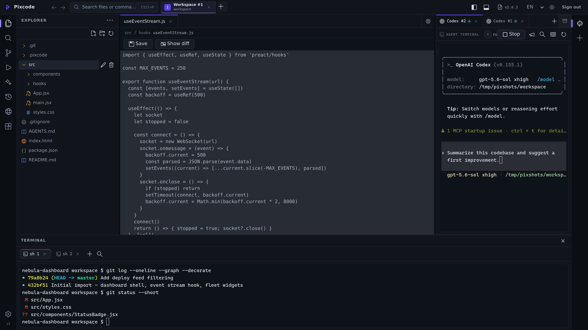
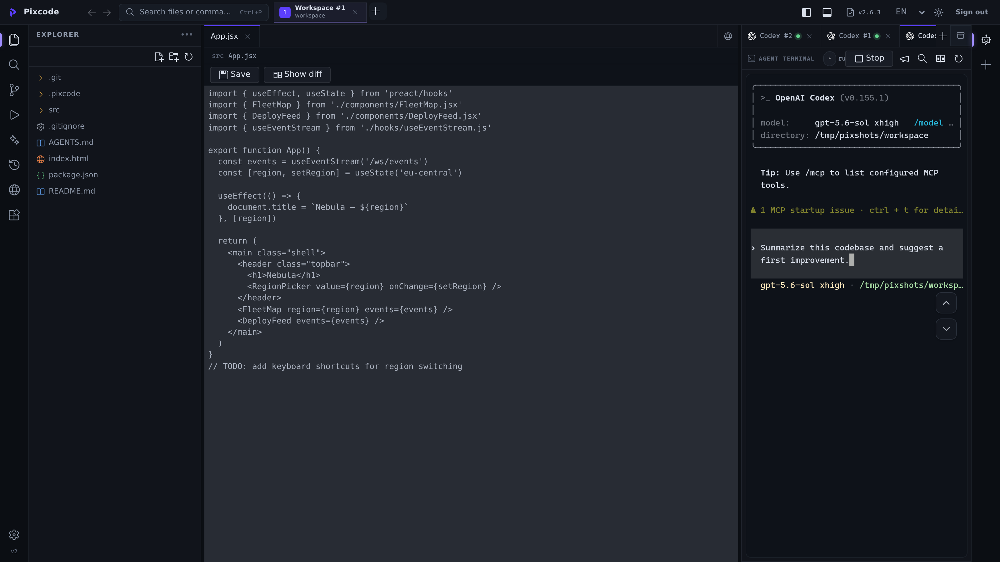
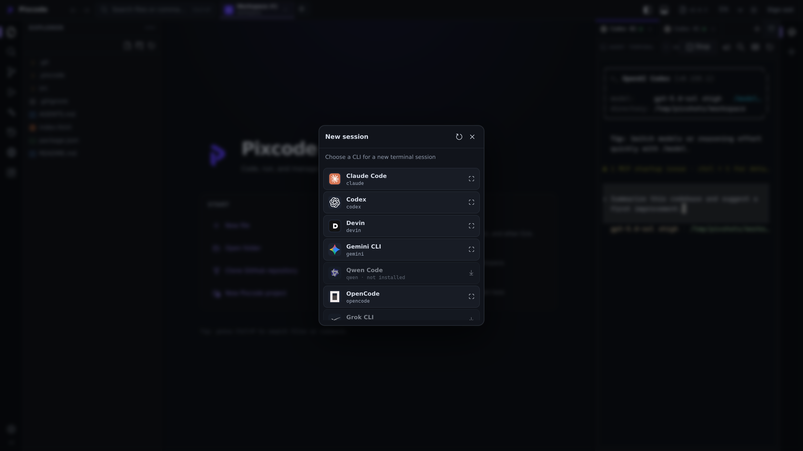
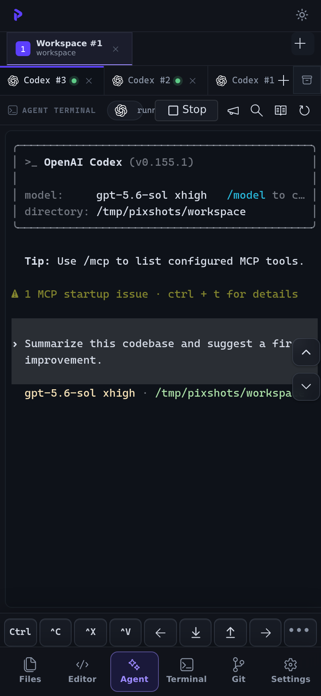
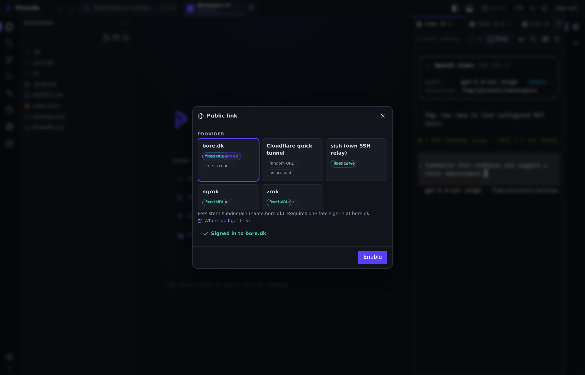

<div align="center">
  
  <h1>Harpy</h1>
  <p><strong>Self-hosted control plane for AI coding agents.</strong></p>
  <p>
    Harpy wraps the coding CLIs you already use — Claude Code, Codex, Gemini CLI,
    Qwen Code, OpenCode, Grok CLI, Devin — in one persistent workspace you can reach
    from a browser, a phone, or the desktop app.
  </p>
  <p>
    <a href="https://www.npmjs.com/package/@harpy-run/harpy"></a>
    <a href="https://github.com/harpy-run/harpy/releases/latest"></a>
    
    
    <a href="LICENSE"></a>
    <a href="https://github.com/harpy-run/harpy/discussions"></a>
  </p>
  <p>
    <a href="https://buymeacoffee.com/alicomert" target="_blank" rel="noopener noreferrer"></a>
  </p>
  <p>
    <a href="https://harpy.run">Website</a> ·
    <a href="https://github.com/harpy-run/harpy/releases/latest">Releases</a> ·
    <a href="CONTRIBUTING.md">Contributing</a>
  </p>
  <p>
    <a href="https://github.com/harpy-run/harpy/blob/main/docs/languages/README.tr.md">Türkçe</a> ·
    <a href="https://github.com/harpy-run/harpy/blob/main/docs/languages/README.de.md">Deutsch</a> ·
    <a href="https://github.com/harpy-run/harpy/blob/main/docs/languages/README.ru.md">Русский</a> ·
    <a href="https://github.com/harpy-run/harpy/blob/main/docs/languages/README.ja.md">日本語</a> ·
    <a href="https://github.com/harpy-run/harpy/blob/main/docs/languages/README.ko.md">한국어</a> ·
    <a href="https://github.com/harpy-run/harpy/blob/main/docs/languages/README.zh-CN.md">简体中文</a>
  </p>
</div>

## What Harpy Does

Harpy is a local web and desktop workbench for AI coding agents. A small Node
backend serves the UI over HTTP and multiplexes everything — files, Git,
terminals, agent sessions — over a single authenticated WebSocket. Run it on
your laptop or a server, then connect from anywhere.

- Keep Claude Code, Codex, Gemini CLI, Qwen Code, OpenCode, Grok CLI, and Devin
  sessions side by side in one project screen.
- Browse and edit files, watch changes stream in live, run shells, and review
  Git status without leaving the app.
- Agent sessions are real PTYs on the server — they keep running when you close
  the tab, and reconnect cleanly from another device.
- Share the whole workspace over a public HTTPS link in one click when a
  teammate or your phone needs in.
- Add teammates with role-based access and per-project allowlists instead of
  handing out SSH.

Harpy is not a hosted cloud IDE. Your code, CLI sessions, credentials, and
project paths stay on the machine where Harpy runs unless you deliberately
expose them.

## Screenshots

| Workbench | Agent session |
| --- | --- |
|  |  |

| New session | Mobile | Public link |
| --- | --- | --- |
|  |  |  |

## Core Features

### Multi-CLI agent sessions

Every supported coding CLI runs as a first-class terminal session, with the
provider's own TUI and behavior intact.

- Claude Code · Codex · Devin · Gemini CLI · Qwen Code · OpenCode · Grok CLI
- New-session picker shows which CLIs are installed and offers one-line
  installers for the missing ones.
- Sessions live on the server and survive browser refreshes and reconnects.
- Presence strip shows who else is working; session tabs carry unread-output
  markers.
- Broadcast one prompt to several running sessions at once.

### Automations

Event-driven background agent runs defined as Markdown files in
`$HARPY_HOME/automations/<ws-hash>/*.md` — the differentiator: **triggers
are cheap and local, so an idle workspace burns zero tokens.**

```markdown
---
name: lint-watch
on: fs                        # fs | cron | webhook | session-end
paths: ["src/**/*.js"]        # fs triggers only
schedule: "0 3 * * 1"         # cron triggers (or "every 30m")
gate: npx eslint --quiet      # exit 0 = nothing to do → no agent spawns
agent: codex                  # any installed CLI adapter
isolated: true                # run inside a detached git worktree
cooldown: 300                 # seconds between runs
---
A lint failure appeared in {files}. Fix it and report the diff.
```

- **Gate-first design:** the `gate` command runs locally (60s cap). Only a
  nonzero exit spawns the agent — a quiet repo never calls an LLM.
- **Triggers:** file watcher (reuses the live-sync watcher, debounced),
  cron/`every N` schedules, inbound HMAC webhooks at `/api/hooks/<slug>`
  (pair with the public link for GitHub/Linear events), and session-end.
- **Isolation:** `isolated: true` runs the agent in a detached git worktree
  under `~/.harpy/worktrees/`, cleaned up when the session ends or swept at
  boot — background runs never touch your working tree.
- **Safety:** per-automation cooldown, one-at-a-time runs, a global
  concurrency cap, and automation sessions never trigger other automations.
- Runs appear as normal sessions in the Agents panel (watchable, stoppable),
  are recorded in the activity log and in run history, and can be managed
  from **Settings → Automations** or edited as plain files on disk.

### Memory and handoffs

Each workspace gets a `.harpy/` directory agents can read and write:

- `MEMORY.md` holds durable facts — when a session ends, a short background CLI
  run distills what is worth remembering.
- Handoff snapshots let a new session pick up where the last one stopped.

### Files, editor, and shell

- Explorer tree with live filesystem sync — changes from any side appear
  instantly.
- CodeMirror editor with save and diff views.
- xterm.js terminal panel with tabs, search, and resize — on touch devices you
  get drag scrolling and an extra-keys tray (Ctrl, arrows, paste).
- Command palette search (`Ctrl+P`) across files and actions.

### Source control

- Git panel for status, diffs, branches, and commits.
- GitHub sign-in built in: web OAuth (auto-bootstrapped app manifest), device
  flow, or a manual PAT.

### Public link

Expose the daemon on a public HTTPS URL from Settings → Public link, or with
`harpy share`. Backed by bore.dk, Cloudflare quick tunnels, a self-hosted sish
relay, ngrok, or zrok. A supervisor respawns the tunnel if it drops, and bore.dk
sign-in works headless — approve it from your phone.

### Multi-user access

- First-run setup creates the owner account; admins can add members.
- Per-user allowlists for projects and agents, disable/delete revokes live.
- Per-user CLI environment variables and optional private CLI home directories.
- `hp_` API keys for automation authenticate both the REST routes and the
  multiplexed WebSocket.

### Notifications

- In-app and browser notifications when an agent session finishes or writes a
  handoff.
- Optional outbound webhook (ntfy.sh, Discord, or any URL) via
  `harpy settings set webhook <url>`.

### Extras

- Activity log per workspace (fs ops, Git, session lifecycles).
- Skill manager — install SKILL.md collections from a git repo into an agent's
  skills directory.
- Dark and light themes; UI in 9 languages.
- PWA service worker for installable, offline-shell behavior on mobile.
- Self-update channel: `harpy update` checks npm and GitHub releases.

## Installation

### Requirements

- Node.js 22 or newer.
- The provider CLIs you want to use, installed and authenticated separately.

### Run with npx

```bash
npx @harpy-run/harpy
```

Open:

```text
http://localhost:3001
```

### Install globally

```bash
npm install -g @harpy-run/harpy
harpy
```

### Desktop shell

Distribution is npm-only — there are no published installers. A Tauri shell
can still be built locally from source when a desktop window is wanted:

```bash
npm run desktop:build
```

### Background server and autostart

For a server or VDS setup:

The lightweight daemon keeps the HTTP/WebSocket server (and any running CLI
PTYs) alive after the browser or desktop window is closed. It uses systemd on
Linux when available, a desktop autostart entry as a fallback, LaunchAgent on
macOS, and the user Startup folder on Windows. No extra runtime dependency is
installed.

```bash
harpy daemon install --port 3001   # enable login autostart and start now
harpy daemon status                # inspect PID, port and autostart state
harpy daemon logs                  # inspect the background server log
harpy daemon restart               # restart without changing the port
harpy daemon disable               # stop and remove autostart
```

Run in the foreground when developing:

```bash
harpy start --port 3001
```

### Ports

- Installed backend and bundled frontend: `PORT`/`HARPY_PORT`, default `3001`.
- Vite-only frontend development: `5199` (proxies API/WebSocket requests to the backend).

For normal installed usage, think in terms of one port: `3001`.

### Upgrading from Pixcode

Harpy is the renamed Pixcode. Existing installs keep their data with a one-time
manual rename before upgrading: `mv ~/.pixcode ~/.harpy` and rename
`pixcode-projects/` to `harpy-projects/` (or point `HARPY_PROJECTS` at it).
`PIXCODE_*` env vars, `px_` API keys, and `pixcode.service` units are no longer
read — recreate keys and run `harpy daemon install` after upgrading.

## First Run

1. Open Harpy and set the owner password (≥ 6 characters).
2. Pick or create the workspace you want to work in.
3. Open a new agent session and pick a CLI — missing ones show an install
   command you can run in place.
4. Open Settings to manage users, API keys, skills, and notifications.
5. Enable a public link if you want to reach the workspace from another device.

## Development

```bash
npm install
npm run lint
npm run build
```

Important development notes:

- `npm run dev` starts the Vite frontend on port `5199`; keep `npm start`
  running separately for API/WebSocket requests.
- `npm start` runs the backend in the foreground on the stable port `3001`; use
  `harpy daemon install` when it should survive shell/browser closure.
- `npm run desktop:build` stages the bundled Node runtime and production server
  dependencies before Tauri creates a local desktop build (installers are no
  longer published — npm is the only distribution channel).
- There is no unit test or typecheck script configured today. Use smoke scripts
  (`scripts/smoke.mjs` against a running server), lint, build, and manual
  provider/API checks.

## Repository Map

- `src/` - Preact + Vite frontend (Tailwind v4, `@preact/signals` state).
- `server/` - Node HTTP/WebSocket backend and the `harpy` CLI.
- `server/channels/` - one file per WS channel (`fs`, `git`, `pty`, `agent`,
  `project`, `auth`, `activity`, `share`, `system`).
- `server/agents/adapters/` - CLI adapters, one per supported coding agent.
- `src-tauri/` - Tauri 2 desktop shell.
- `public/` - static assets and the service worker.
- `docs/` - design docs, translated READMEs, and product screenshots.
- `scripts/` - standalone smoke/maintenance scripts.

## Security Model

- Harpy is self-hosted. Treat it like a local control plane for your machine.
- Use strong local account credentials when exposing it on a network.
- Put public-server deployments behind a trusted reverse proxy, VPN, or
  firewall — or use the built-in public-link tunnel deliberately.
- API keys are intended for automation. Rotate them if they are exposed.
- Provider secrets are write-only in APIs and UI responses where possible.
- Do not publish logs that contain provider tokens, session output, or private
  project paths.

See [`SECURITY.md`](SECURITY.md) for vulnerability reporting.

## Contributing

Read [`CONTRIBUTING.md`](CONTRIBUTING.md) before opening a pull request. Keep
changes scoped, run `npm run lint` and `npm run build`, and include screenshots
or short recordings for UI work when possible.

For community behavior expectations, read
[`CODE_OF_CONDUCT.md`](CODE_OF_CONDUCT.md).

## Links

- Website: <https://harpy.run>
- npm: <https://www.npmjs.com/package/@harpy-run/harpy>
- GitHub: <https://github.com/harpy-run/harpy>
- Releases: <https://github.com/harpy-run/harpy/releases/latest>

Harpy is an independent open-source project and is not affiliated with OpenAI,
Anthropic, Google, Cursor, Alibaba/Qwen, xAI, or OpenCode.
